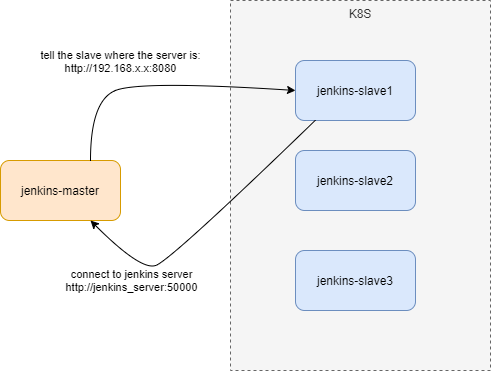
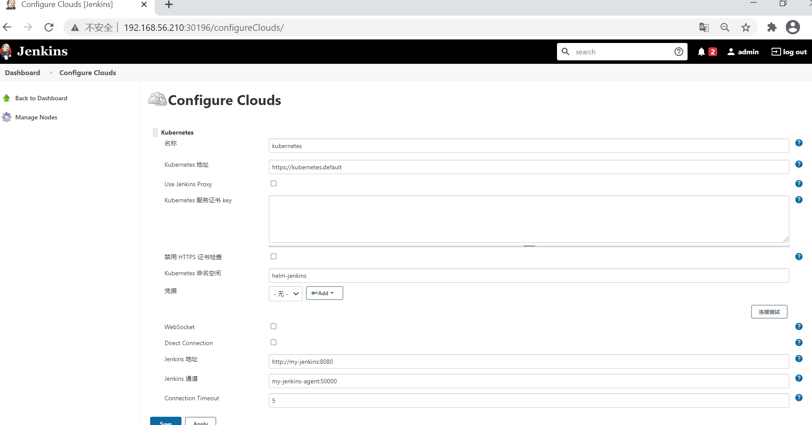
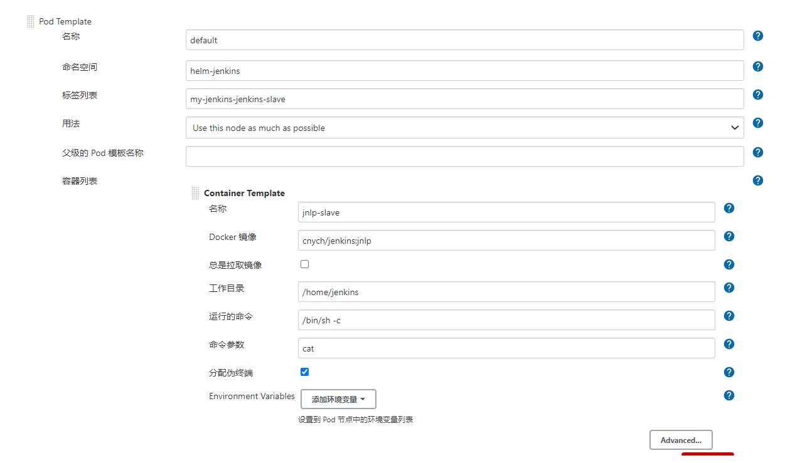

# Install Jenkins




## 使用名为helm-jenkins的namespace，执行以下命令创建：

```
kubectl create namespace helm-jenkins
```

## 创建PV
为了后面的jenkins服务顺利启动，需要预先部署好pv：

新建名为pv-helm-jenkins.yaml的文件，内容如下，其中192.168.133.142是NFS服务器地址，/usr/local/work/test/002是分配给本次实战使用的NFS文件夹：


```
apiVersion: v1
kind: PersistentVolume
metadata:
 name: helm-jenkins
 namespace: helm-jenkins
spec:
 capacity:
 storage: 10Gi
 accessModes:
 - ReadWriteOnce
 persistentVolumeReclaimPolicy: Recycle
 nfs:
 path: /usr/local/work/test/002
 server: 192.168.133.142
```

执行命令kubectl create -f pv-helm-jenkins.yaml，创建PV；
查看PV是否已经就绪：
确保以下helm repo准备好(如果没有可以通过helm repo add添加)：
执行以下命令，即可创建jenkins的deployment、service等资源：

```
helm install --namespace helm-jenkins --name my-jenkins stable/jenkins
```

上述内容的第一条给出重要提示：获取admin账号密码的方法，执行以下命令即可：
```
printf $(kubectl get secret --namespace helm-jenkins my-jenkins -o jsonpath="{.data.jenkins-admin-password}" | base64 --decode);echo

```

检查服务，发现helm-jenkins这个namespace下有两个服务：my-jenkins和my-jenkins-agent，前者就是jenkins网站，后者用来接收执行任务的jenkins实例的注册：

```
[root@node1 helm-jenkins]# kubectl get svc -n helm-jenkins
NAME TYPE CLUSTER-IP EXTERNAL-IP PORT(S) AGE
my-jenkins LoadBalancer 10.233.10.35 <pending> 8080:31763/TCP 31m
my-jenkins-agent ClusterIP 10.233.35.20 <none> 50000/TCP 31m
```

my-jenkins这个服务的类型是LoadBalancer，8080端口被映射到宿主机的31763端口，因此，使用kubernetes集群中一台宿主机的IP，再加上31763端口即可通过浏览器访问；
至此，jenkins安装已完成，接下来要做必要的设置.

## 设置kubernetes插件
为了让jenkins在以下模式工作，还需要设置kubernetes插件

点击下图红框中的"Manage Jenkins",进入设置页面

## helm安装jenkins
确保helm2.16.1版本安装完毕，并且可以正常工作：



## 说明一下：

Name 处默认为 kubernetes，也可以修改为其他名称，如果这里修改了，下边在执行 Job 时指定 podTemplate() 参数 cloud 为其对应名称，否则会找不到，cloud 默认值取：kubernetes
Kubernetes URL 处我填写了 https://kubernetes.default 这里我填写了 Kubernetes Service 对应的 DNS 记录，通过该 DNS 记录可以解析成该 Service 的 Cluster IP，注意：也可以填写 https://kubernetes.default.svc.cluster.local 完整 DNS 记录，因为它要符合 <svc_name>.<namespace_name>.svc.cluster.local 的命名方式，或者直接填写外部 Kubernetes 的地址 https://<ClusterIP>:<Ports>。
Jenkins URL 处我填写了 http://jenkins.kubernetes-plugin:8080，跟上边类似，也是使用 Jenkins Service 对应的 DNS 记录，不过要指定为 8080 端口，因为我们设置暴漏 8080 端口。同时也可以用 http://<ClusterIP>:<Node_Port> 方式，例如我这里可以填 http://192.168.99.100:30645 也是没有问题的，这里的 30645 就是对外暴漏的 NodePort。
配置完毕，可以点击 “Test Connection” 按钮测试是否能够连接的到 Kubernetes，如果显示 Connection test successful 则表示连接成功，配置没有问题。

## 测试并验证

好了，通过 Kubernetes 安装 Jenkins Master 完毕并且已经配置好了连接，接下来，我们可以配置 Job 测试一下是否会根据配置的 Label 动态创建一个运行在 Docker Container 中的 Jenkins Slave 并注册到 Master 上，而且运行完 Job 后，Slave 会被注销并且 Docker Container 也会自动删除吧！

### pipeline 类型支持
创建一个 Pipeline 类型 Job 并命名为 my-k8s-jenkins-pipeline，然后在 Pipeline 脚本处填写一个简单的测试脚本如下：

```
def label = "mypod-${UUID.randomUUID().toString()}"
podTemplate(label: label, cloud: 'kubernetes') {
    node(label) {
        stage('Run shell') {
            sh 'sleep 130s'
            sh 'echo hello world.'
        }
    }
}
```

### Container Group 类型支持
创建一个 Pipeline 类型 Job 并命名为 my-k8s-jenkins-container，然后在 Pipeline 脚本处填写一个简单的测试脚本如下：

```
def label = "mypod-${UUID.randomUUID().toString()}"
podTemplate(label: label, cloud: 'kubernetes', containers: [
    containerTemplate(name: 'maven', image: 'maven:3.3.9-jdk-8-alpine', ttyEnabled: true, command: 'cat'),
  ]) {

    node(label) {
        stage('Get a Maven Project') {
            git 'https://github.com/jenkinsci/kubernetes-plugin.git'
            container('maven') {
                stage('Build a Maven project') {
                    sh 'mvn -B clean install'
                }
            }
        }
    }
}
```
注意：这里我们使用的 containers 定义了一个 containerTemplate 模板，指定名称为 maven 和使用的 Image，下边在执行 Stage 时，使用 container('maven'){...} 就可以指定在该容器模板里边执行相关操作了。比如，该示例会在 jenkins-slave 中执行 git clone 操作，然后进入到 maven 容器内执行 mvn -B clean install 编译操作。这种操作的好处就是，我们只需要根据代码类型分别制作好对应的编译环境镜像，通过指定不同的 container 来分别完成对应代码类型的编译操作。模板详细的各个参数配置可以参照 Pod and container template configuration。

执行构建，跟上边 Pipeline 类似，也会新建 jenkins-slave 并注册到 master，不同的是，它会在 Kubernetes 中启动我们配置的 maven 容器模板，来执行相关命令。

### 非 Pipeline 类型支持

Jenkins 中除了使用 Pipeline 方式运行 Job 外，通常我们也会使用普通类型 Job，如果也要想使用kubernetes plugin 来构建任务，那么就需要点击 “系统管理” —> “系统设置” —> “云” —> “Kubernetes” —> “Add Pod Template” 进行配置 “Kubernetes Pod Template” 信息。



注意：这里的 Labels 名在配置非 pipeline 类型 Job 时，用来指定任务运行的节点。Containers 下的 Name 字段的名字，这里要注意的是，如果 Name 配置为 jnlp，那么 Kubernetes 会用下边指定的 Docker Image 代替默认的 jenkinsci/jnlp-slave 镜像，否则，Kubernetes plugin 还是会用默认的 jenkinsci/jnlp-slave 镜像与 Jenkins Server 建立连接，即使我们指定其他 Docker Image。这里我随便配置为 jnlp-slave，意思就是使用默认的 jenkinsci/jnlp-slave 镜像来运行，因为我们暂时还没制作可以替代默认镜像的镜像。

新建一个自由风格的 Job 名称为 my-k8s-jenkins-simple，配置 “Restrict where this project can be run” 勾选，在 “Label Expression” 后边输出我们上边创建模板是指定的 Labels 名称 jnlp-agent，意思是指定该 Job 匹配 jnlp-agent 标签的 Slave 上运行。

### 配置自定义 jenkins-slave 镜像

通过 kubernetest plugin 默认提供的镜像 jenkinsci/jnlp-slave 可以完成一些基本的操作，它是基于 openjdk:8-jdk 镜像来扩展的，但是对于我们来说这个镜像功能过于简单，比如我们想执行 Maven 编译或者其他命令时，就有问题了，那么可以通过制作自己的镜像来预安装一些软件，既能实现 jenkins-slave 功能，又可以完成自己个性化需求，那就比较不错了。如果我们从头开始制作镜像的话，会稍微麻烦些，不过可以参考 jenkinsci/jnlp-slave 和 jenkinsci/docker-slave 这两个官方镜像来做，注意：jenkinsci/jnlp-slave 镜像是基于 jenkinsci/docker-slave 来做的。这里我简单演示下，基于 jenkinsci/jnlp-slave:latest 镜像，在其基础上做扩展，安装 Maven 到镜像内，然后运行验证是否可行吧。

创建一个 Pipeline 类型 Job 并命名为 my-k8s-jenkins-container-custom，然后在 Pipeline 脚本处填写一个简单的测试脚本如下：

```
def label = "mypod-${UUID.randomUUID().toString()}"
podTemplate(label: label, cloud: 'kubernetes',containers: [
    containerTemplate(
        name: 'jnlp', 
        image: 'huwanyang168/jenkins-slave-maven:latest', 
        alwaysPullImage: false, 
        args: '${computer.jnlpmac} ${computer.name}'),
  ]) {

    node(label) {
        stage('stage1') {
            stage('Show Maven version') {
                sh 'mvn -version'
                sh 'sleep 60s'
            }
        }
    }
}
```

说明一下：这里 containerTemplate 的 name 属性必须叫 jnlp，Kubernetes 才能用自定义 images 指定的镜像替换默认的 jenkinsci/jnlp-slave 镜像。此外，args 参数传递两个 jenkins-slave 运行需要的参数。还有一点就是这里并不需要指定 container('jnlp'){...} 了，因为它被 Kubernetes 指定了要被执行的容器，所以直接执行 Stage 就可以了。


当然，我们也可以使用非 Pipeline 类型指定运行该自定义 slave，那么我们就需要修改 “系统管理” —> “系统设置” —> “云” —> “Kubernetes” —> “Add Pod Template” 修改配置 “Kubernetes Pod Template” 信息如下：

## NOTE

plugin offline download website
```
http://updates.jenkins-ci.org/download/plugins/
安装jenkins 不能联网，安装插件的解决方法
升级站点替换url：     http://mirror.xmission.com/jenkins/updates/update-center.json


插件下载  http://updates.jenkins-ci.org/download/plugins/


升级站点：http://updates.jenkins.io/update-center.json

http://mirror.xmission.com/jenkins/updates/update-center.json


插件可选   http://127.0.0.1:8080/jenkins/pluginManager/available   
```
